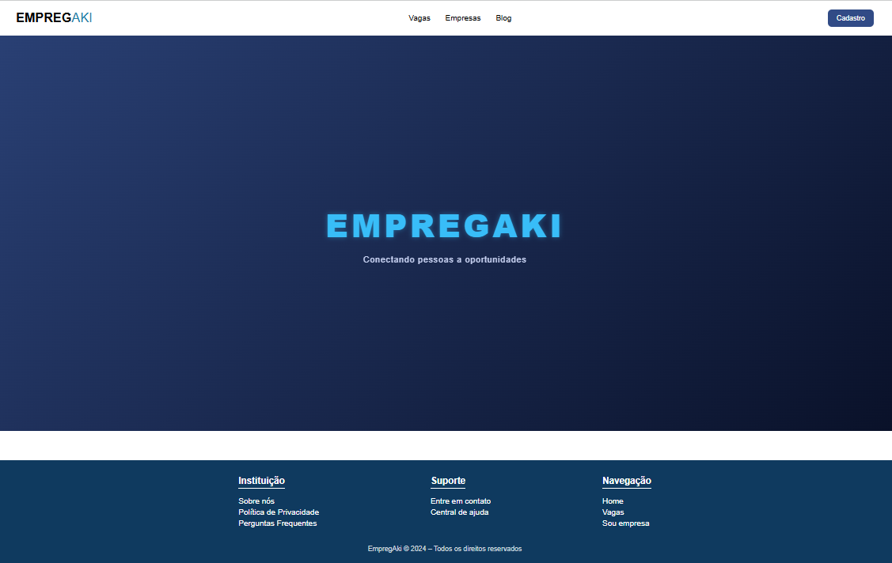
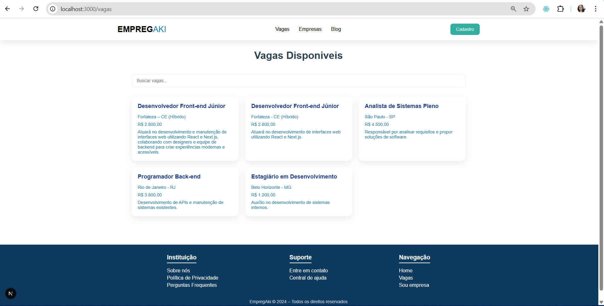
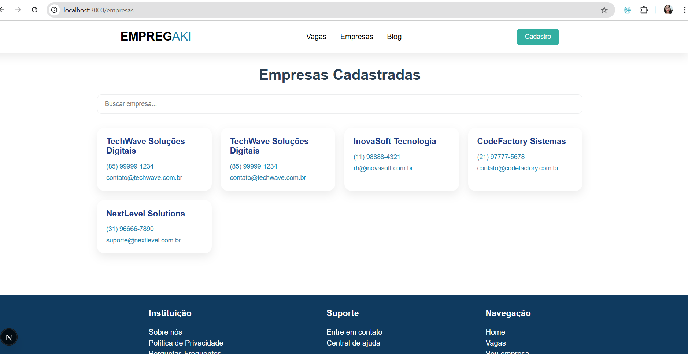

Isso é um projeto [Next.js](https://nextjs.org) com [`create-next-app`](https://nextjs.org/docs/app/api-reference/cli/create-next-app).

# EmpregAki
EmpregAki é uma aplicação web desenvolvida com Next.js cujo objetivo é divulgar vagas de emprego e apresentar informações sobre empresas cadastradas, de forma simples e acessível.

Este projeto foi criado utilizando o create-next-app e segue uma estrutura pensada para iniciantes em desenvolvimento web.

## Descrição do Projeto
O EmpregAki permite que usuários visualizem vagas de emprego disponíveis e consultem informações básicas sobre as empresas que oferecem essas vagas.

Funcionalidades principais:
- Listagem de vagas de emprego disponíveis;
- Listagem de empresas cadastradas;
- Visualização de dados de contato das empresas.

## Tecnologias Utilizadas
- Frame-Work:

    [](https://skillicons.dev)

- FrontEnd:

    [](https://skillicons.dev)

- BackEnd:

    [](https://skillicons.dev)

- Banco de dados:

    [](https://skillicons.dev)

- Hospedagem e controle de versão:

    [](https://skillicons.dev)

## Design do Projeto
### Página Inicial (Home)


### Página de Vagas Disponíveis


### Página de Informações das Empresas



## Endepoints do Projeto
- ``http://localhost:3000/``
 Direciona para a página inicial do projeto.

- ``http://localhost:3000/vagas``
 Exibe todas as vagas cadastradas e disponíveis para os usuários.
```json
[
  {
    "id": 1,
    "title": "Desenvolvedor Front-end Júnior",
    "description": "Atuará no desenvolvimento e manutenção de interfaces front-end para criar experiências modernas e acessíveis.",
    "requirement": "Conhecimentos básicos em HTML, CSS e JavaScript. Noções de React. Vontade de aprender e trabalhar em equipe.",
    "area": "Tecnologia da Informação",
    "salary": "R$ 2.800,00",
    "location":"Fortaleza - CE (Híbrido)",
    "workload": "40h semanais",
    "num_vagas": 2,
    "contact_vaga": "recrutamento@techwave.com.br",
    "deadline": "2025-03-30",
    "id_cnpj": "10000100000001"
  },
]

```
- ``http://localhost:3000/empresas``
Mostra as principais informações das empresas cadastradas no sistema.
```json
[
  {
    "cnpj": "12345678000199",
    "name": "TechWave Soluções Digitais",
    "email": "contato@techwave.com.br",
    "contact": "(85) 99999-1234"
  },
]

```

## Como Execultar o Back-end

O back-end está integrado ao próprio projeto Next.js, utilizando rotas e conexão com banco de dados hospedado na Vercel.

Para executá-lo, basta iniciar o projeto normalmente com:

    npm run dev

As requisições são feitas diretamente pelas páginas do projeto.

## Funcionalidades
- Exibição de vagas de emprego;
- Consulta de empresas cadastradas;
- Integração com banco de dados;
- Interface simples e intuitiva;
- Projeto organizado para fins educacionais.

## Implementações Futuras
- [x] Mostrar Vagas;
- [x] Mostrar Empresas cadastradas
- [x] Barra de Pesquisas;
- [] Cadastro de novas vagas via formulário;
- [] Cadastro de empresas pelo sistema;
- [] Sistema de login e autenticação;
- [] Filtro e busca de vagas por área;
- [] Página de detalhes da vaga;
- [] Melhorias no layout e responsividade.

## Contato
Projeto desenvolvido para fins acadêmicos e de aprendizado.

📧 Email: anapaulapetrova23@gmail.com

🌐 GitHub: https://github.com/AnaPaulaPetrova

🔗 LinkedIn: https://www.linkedin.com/in/ana-paula-silva-lopes-7408b0363?utm_source=share&utm_campaign=share_via&utm_content=profile&utm_medium=android_app